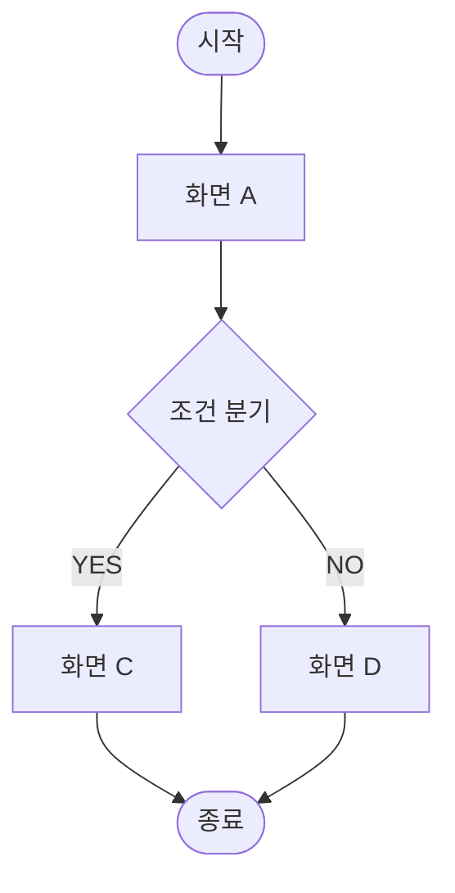
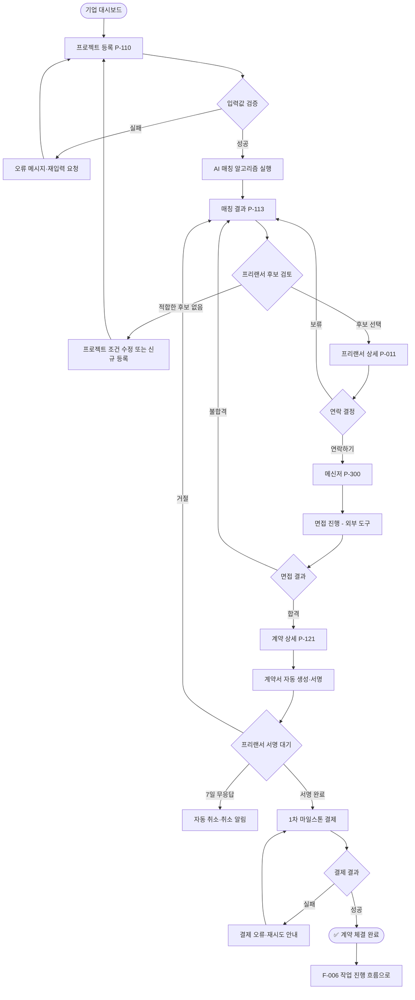

## 이 문서는

사용자가 **목적을 달성하기 위해 거치는 단계와 분기**를 시각화한 흐름도.

"이 사용자가 가입부터 결제까지 어떤 경로로 이동하는가, 어디서 멈출 수 있는가, 잘못된 분기는 어디로 가는가" 를 정리한다.

IA·시나리오·화면 정의서와의 관계:

|구분|IA|User Scenario|User Flow|화면 정의서|
|---|---|---|---|---|
|대상|페이지 구조 (정적)|사용자 맥락·동기 (서술)|행동 흐름 (시각·동적)|화면 1개 (상세)|
|단위|페이지·메뉴|상황·인물·결과|Step·분기·결과|화면 1개|
|질문|어떤 페이지들이 있는가?|사용자가 왜·어떻게 쓰는가?|어떤 경로로 이동하는가?|이 화면은 무엇으로?|
|깊이|전체 조감|텍스트 시나리오|화면 간 이동·분기|컴포넌트·정책|

**핵심**: User Flow는 IA(정적 구조)와 화면 정의서(상세) 사이의 **동적 다리**. 사용자가 페이지들 사이를 어떻게 움직이는지가 여기서 결정된다.

### User Flow의 3가지 종류

|종류|목적|표현 방식|
|---|---|---|
|**Task Flow**|단일 경로 (분기 없음)|직선 흐름. "정상 시나리오만"|
|**User Flow**|분기·예외 포함|분기·실패·취소까지|
|**Wire Flow**|User Flow + 와이어프레임|노드에 실제 화면 미리보기|

이 가이드는 **User Flow (분기·예외 포함)** 기준. 가장 자주 쓰임.

## 언제 만드나

- IA 합의 후, 화면 정의서 작성 직전
- 핵심 사용자 여정(가입·결제·매칭 등)을 명세화할 때
- 기존 서비스의 특정 흐름을 개선할 때 (Before / After 비교)
- 분기·예외 케이스가 많은 기능 설계 시
- 개발·디자인·QA가 같은 흐름을 보고 일할 필요가 있을 때

**기준**: "이 기능 사용자가 어떤 경로로 가는지 그려달라"는 질문이 나올 때.

### 어떤 흐름을 그릴까

서비스의 모든 흐름을 다 그릴 필요는 없다. **핵심 흐름 5~10개**가 적정:

- 회원가입·로그인
- 핵심 가치 달성 흐름 (예: 매칭 → 계약)
- 결제·정산
- 신규 사용자 온보딩
- 자주 발생하는 예외 (분쟁·환불·취소)

## 어떤 툴로

|툴|추천도|이유|
|---|---|---|
|**Figma / FigJam**|⭐ 강력 추천|시각화·협업·와이어 연결 강함|
|**Whimsical**|⭐ 추천|User Flow 전용 도구|
|**Miro**|추천|워크숍·실시간 협업|
|draw.io / Lucidchart|보조|무료, 텍스트 기반|
|노션 (텍스트·코드블록)|보조|검색·연결 강함, 시각 약함|
|Mermaid (코드)|보조|Git·노션에서 텍스트로 관리|

**팁**: 시각형(Figma)으로 메인 흐름 + 텍스트형(노션·Mermaid)으로 백업·검색. 두 가지 동시 보유 권장.

## 표기 표준 (도형·기호)

|도형|의미|
|---|---|
|⬛ **사각형**|화면·페이지 (User가 보는 것)|
|◇ **마름모**|분기 (조건·선택)|
|⬭ **타원**|시작·종료점|
|⬜ **둥근 사각형**|시스템 액션 (사용자에게 안 보이는 처리)|
|→ **화살표**|흐름 방향|
|⚠️ **노란 표시**|예외·실패 경로|
|✅ **체크**|성공 종료|
|🔴 **빨간 표시**|사용자 이탈 가능 지점|

색·도형은 팀 내 통일이 가장 중요. 다른 곳에서 변경 가능.

## 들어가야 할 것

- 흐름의 목적 (Goal)
- 시작점·종료점
- 사용자 권한·상황 (전제 조건)
- 화면 노드 (페이지 ID 포함)
- 분기와 조건
- 예외 경로 (실패·취소·이탈)
- 시스템 액션 (사용자에게 안 보이는 처리)
- 다음 단계 (이 흐름이 끝나면 어디로)

## 작성 절차

1. **IA 확인** — IA에 없는 페이지가 User Flow에 등장하면 안 됨
2. **흐름의 시작점·종료점 정의** — 어디서 시작해 어디서 끝나는지
3. **핵심 경로(Happy Path) 먼저** — 정상 흐름을 직선으로
4. **분기 추가** — "만약 ___이면?" 으로 분기 채움
5. **예외·실패 경로 추가** — 사용자가 이탈할 수 있는 지점 표시
6. **시스템 액션 명시** — 사용자에겐 안 보이지만 시스템이 하는 일 (메일 발송·상태 변경 등)
7. **이해관계자 리뷰** — 디자인·개발·QA·CS
8. **화면 정의서로 분기** — 각 화면 노드를 화면 정의서 페이지로 링크

---

# 🔲 양식 1 — Flow 메타 정보

## 메타

|항목|내용|
|---|---|
|Flow 이름|(예: 회원가입·매칭·결제 등)|
|Flow ID|F-NNN (예: F-001)|
|버전|v0.x / v1.0|
|상태|🟡 초안 / 🟠 검토 / 🟢 확정|
|작성자||
|작성일||
|대상 사용자|(게스트 / 기업 / 프리랜서 / 관리자)|
|전제 조건|(이 흐름 시작 전에 충족되어야 할 조건)|
|종료 조건|(이 흐름이 끝나면 도달한 상태)|
|예상 소요 시간||
|관련 페이지 (IA 링크)||
|관련 화면 정의서||

---

# 🔲 양식 2 — 핵심 경로 (Happy Path)

> 정상적으로 흘렀을 때의 경로. 분기 없이 직선

```
[시작] → Step 1 → Step 2 → Step 3 → ... → [종료]
```

|Step|화면/액션|사용자 행동|시스템 액션|페이지 ID|
|---|---|---|---|---|
|1||||P-XXX|
|2|||||

---

# 🔲 양식 3 — 분기 흐름 (Branching Flow)

> Mermaid 표기 예시 — 노션에서 그대로 사용 가능



> 시각형은 Figma·Whimsical로 별도 작성, 노션엔 텍스트 백업

## 분기 정의 표

|분기점 ID|위치|조건|YES 경로|NO 경로|
|---|---|---|---|---|
|B-01|(Step N)|(조건 문장)|→ Step ___|→ Step ___|
|B-02|||||

---

# 🔲 양식 4 — 예외·실패 경로

|예외 ID|발생 지점|상황|사용자에게 보이는 것|회복 경로|
|---|---|---|---|---|
|E-01|Step N|(실패 사유)|(오류 메시지·안내)|(어디로 보내는가)|
|E-02|||||

---

# 🔲 양식 5 — 이탈 가능 지점 (Drop-off Points)

> 사용자가 흐름을 포기할 가능성이 있는 지점 식별

|지점 ID|위치|이탈 사유 (예상)|대응|
|---|---|---|---|
|D-01|Step N|(왜 이탈할까)|(사전·사후 대응)|
|D-02||||

이 지점들은 이벤트 트래킹(Analytics)에서 funnel 분석 대상.

---

# 🔲 양식 6 — 시스템 액션 (Backstage)

> 사용자에겐 안 보이지만 시스템이 처리하는 것

|Step|시스템 액션|비고|
|---|---|---|
|가입 완료|환영 이메일 발송|별도 워커|
|매칭 완료|양쪽에 푸시 알림||
|결제 완료|영수증 메일 + 회계 시스템 연동||

---

# 📌 예시 — TalentMatch / F-005 매칭 → 계약 흐름

> 가상 사례. PRD의 핵심 가치 흐름. 가장 중요한 User Flow

## 메타

|항목|내용|
|---|---|
|Flow 이름|매칭 → 계약 완료 (기업 측 관점)|
|Flow ID|F-005|
|버전|v0.2|
|상태|🟠 검토 중 (디자인·개발 리뷰 진행 중)|
|작성자|홍길동 (PO)|
|작성일|2026-06-22|
|대상 사용자|기업 회원 (가입·인증 완료 상태)|
|전제 조건|기업 회원 가입 + 결제 수단 등록 완료|
|종료 조건|표준 계약서 서명 + 1차 마일스톤 에스크로 결제 완료|
|예상 소요 시간|평균 7일 (등록 → 검토 → 면접 → 계약)|
|관련 페이지 (IA)|P-110, P-111, P-112, P-113, P-011, P-300, P-121|
|관련 화면 정의서|(작성 예정)|

## 핵심 경로 (Happy Path)

```
[기업 대시보드 진입]
   ↓
1. 프로젝트 등록 페이지 (P-110)
   ↓
2. 직무·기간·예산·요구 기술 입력
   ↓ [시스템] AI 매칭 알고리즘 실행 (3초 이내)
3. 매칭 결과 페이지 (P-113) — 추천 프리랜서 5명
   ↓
4. 프리랜서 상세 페이지 (P-011) — 포트폴리오·평가·검증 마크 확인
   ↓
5. 메신저 (P-300) — 1:1 대화·면접 일정 조율
   ↓ [기업 외부 도구로 화상 면접 진행]
6. 계약 상세 페이지 (P-121) — 계약 조건 입력
   ↓ [시스템] 표준 계약서 자동 생성
7. 계약서 검토·서명
   ↓ [시스템] 프리랜서 측에 서명 요청 알림
8. 양쪽 서명 완료 대기
   ↓ [시스템] 프리랜서 서명 완료
9. 1차 마일스톤 결제 화면
   ↓ [시스템] 에스크로 결제 처리 (토스페이먼츠)
10. ✅ 계약 체결 완료 + 진행 중 프로젝트 상태로 전환
   ↓
[종료] → 프리랜서가 작업 시작 → 별도 Flow (F-006) 진입
```

### Step 상세

|Step|화면/액션|사용자 행동|시스템 액션|페이지 ID|
|---|---|---|---|---|
|1|프로젝트 등록|입력 폼 작성|입력값 검증|P-110|
|2|매칭 실행|"매칭 시작" 클릭|AI 알고리즘 실행 (3초)|P-110 → P-113|
|3|매칭 결과 확인|추천 5명 검토|매칭 점수·검증 마크 표시|P-113|
|4|프리랜서 상세 확인|포트폴리오·평가 검토|GitHub 활동 데이터 노출|P-011|
|5|1:1 메신저 시작|"연락하기" → 메시지 발송|프리랜서 측 알림 발송|P-300|
|6|계약 조건 입력|마일스톤·금액 설정|표준 계약서 자동 생성|P-121|
|7|계약서 서명|검토 → 서명|프리랜서 측 서명 요청 알림|P-121|
|8|양쪽 서명 대기|(대기)|프리랜서 서명 완료 시 다음 진행|P-121|
|9|마일스톤 결제|결제 수단 선택 → 결제|에스크로 처리 (토스페이먼츠)|P-121|
|10|완료 확인|결과 확인|진행 중 상태로 전환·양쪽 알림|P-121|

## 분기 흐름 (Mermaid)



## 분기 정의 표

|분기점 ID|위치|조건|YES 경로|NO 경로|
|---|---|---|---|---|
|B-01|Step 2|입력값 검증 통과?|Step 3 (매칭 실행)|오류 메시지 → Step 1|
|B-02|Step 3|추천 5명 중 적합 후보 있음?|Step 4 (상세 검토)|프로젝트 수정 → Step 1|
|B-03|Step 4|연락 결정?|Step 5 (메신저)|Step 3 (다른 후보 검토)|
|B-04|Step 5 후|면접 합격?|Step 6 (계약)|Step 3 (다른 후보)|
|B-05|Step 8|프리랜서 7일 내 서명?|Step 9 (결제)|자동 취소|
|B-06|Step 9|결제 성공?|Step 10 (완료)|재시도 안내|

## 예외·실패 경로

|예외 ID|발생 지점|상황|사용자에게 보이는 것|회복 경로|
|---|---|---|---|---|
|E-01|Step 1|필수 항목 누락|빨간 안내 메시지·해당 필드 강조|같은 화면에서 재입력|
|E-02|Step 2|매칭 결과 0건 (조건 너무 엄격)|"조건을 완화해보세요" 안내 + 추천 조건|Step 1로 복귀해 조건 수정|
|E-03|Step 6|자동 계약서 생성 실패 (시스템 오류)|"잠시 후 다시 시도해주세요" + 고객센터 안내|5분 후 재시도 또는 수동 계약서 fallback|
|E-04|Step 7|기업 측이 7일 내 서명 안 함|(기업에게) 알림 3회 → 자동 취소|Step 1로 새로 등록 가능|
|E-05|Step 8|프리랜서 거절|"거절되었습니다" 안내 + 다른 후보 추천|Step 3로 복귀|
|E-06|Step 9|결제 한도 초과|결제 오류 메시지 + 대체 결제 수단 안내|결제 수단 변경 후 재시도|
|E-07|Step 9|결제 카드 만료|"결제 수단을 확인해주세요"|결제 수단 등록 페이지로 이동|
|E-08|전 단계|세션 만료|로그인 화면으로 이동 + 진행 상태 저장|로그인 후 이어서 진행|

## 이탈 가능 지점 (Drop-off Points)

|지점 ID|위치|이탈 사유 (예상)|대응|
|---|---|---|---|
|D-01|Step 1|입력 항목 많아서 부담|필수·선택 구분 + 진행 표시줄|
|D-02|Step 3|매칭 결과가 기대 이하|매칭 점수 가시화 + 조건 재설정 가이드|
|D-03|Step 5|메시지 보냈는데 응답 없음|"최근 응답률 80%" 같은 사회적 증거 + 24시간 무응답 시 다른 후보 추천|
|D-04|Step 6|계약 조건 입력 복잡|표준 템플릿 제공 + 가이드 툴팁|
|D-05|Step 9|결제 직전 부담|"환불 정책 안내" + 에스크로 보호 강조|

이 지점들은 Analytics 설계에서 funnel 핵심 측정 지표가 됨.

## 시스템 액션 (Backstage)

|Step|시스템 액션|비고|
|---|---|---|
|Step 2 후|AI 매칭 알고리즘 실행 (서버)|3초 이내 응답|
|Step 2 후|매칭 결과 캐시 저장|24시간 유효|
|Step 5|프리랜서 측 푸시·이메일 알림|즉시 발송|
|Step 5|메시지 발송 시점 기록 (응답률 통계용)||
|Step 6|표준 계약서 PDF 자동 생성|법무 검토 완료 템플릿 기반|
|Step 7|프리랜서 측 서명 요청 알림 + 만료 타이머 시작 (7일)||
|Step 7|5일·6일째 추가 알림 (서명 독촉)||
|Step 8|프리랜서 서명 완료 시 기업 측 알림|즉시|
|Step 9|토스페이먼츠 에스크로 결제 처리|API 연동|
|Step 9|결제 성공 시 양쪽에 영수증·확인 이메일||
|Step 10|회계 시스템 연동 (수수료 매출 기록)||
|Step 10|양쪽 메신저에 "프로젝트 시작" 자동 메시지||

## 다음 단계

이 흐름이 끝나면 → **F-006. 작업 진행 흐름** (프리랜서가 마일스톤 단위로 작업 → 결과물 제출 → 기업 승인 → 자금 이체)

---

## 작성 팁

- **Happy Path부터** — 정상 흐름을 먼저 직선으로 그리고, 분기·예외는 그 다음에 추가. 거꾸로 하면 머리 아픔
- **사용자 한 명 기준** — 양면 시장이라도 한쪽 관점에서 그릴 것. "기업 측 흐름" + "프리랜서 측 흐름" 별도. 한 다이어그램에 둘 다 그리면 복잡
- **분기와 예외는 다르다** — 분기는 사용자 선택, 예외는 시스템 실패. 도형·색으로 구분
- **시스템 액션을 명시** — "[시스템] 매칭 알고리즘 실행" 처럼 표기. 안 그러면 개발이 "이거 자동인지 수동인지" 헷갈림
- **이탈 가능 지점 표시** — Analytics 설계의 funnel 측정 지표가 됨. 미리 표시하면 트래킹 누락 없음
- **IA·시나리오와 정합성 검증** — Flow에 등장하는 페이지는 IA에 다 있어야. 빠지면 IA 갱신
- **세션 만료·뒤로 가기 같은 공통 예외 잊지 말기** — 모든 흐름에 공통. 한 번 정의해두면 재사용
- **5~10개 핵심 Flow만** — 모든 흐름을 다 그리려 하지 말 것. 80% 가치는 5개 핵심 Flow에서 나옴
- **Wire Flow로 발전시키기** — 각 노드에 와이어프레임 미니어처를 붙이면 화면 정의서 직전 단계
- **CS·운영팀 리뷰** — 분쟁·환불 같은 흐름은 운영이 가장 현실적. 빼먹지 말 것

## 참고할 만한 외부 예시

- **Nielsen Norman Group — User Journey vs User Flow** https://www.nngroup.com/articles/journey-mapping-vs-user-flows/
- **Figma — User Flow 템플릿** https://www.figma.com/community/file/user-flow-templates
- **Whimsical — User Flow 가이드** https://whimsical.com/user-flow
- **Mermaid — Flowchart 문법** https://mermaid.js.org/syntax/flowchart.html
- **Smashing Magazine — User Flows in UX Design** https://www.smashingmagazine.com/category/user-flow/

## 자주 하는 실수

- **Happy Path 없이 분기부터** — 처음부터 복잡한 분기로 시작 → 정작 정상 흐름이 안 보임
- **분기와 예외 혼동** — 둘을 같은 도형으로 그림 → 사용자 선택인지 시스템 실패인지 구분 불가
- **시스템 액션 누락** — 화면만 그리고 "이메일 발송", "상태 변경" 같은 backstage 누락 → 개발 시 추측
- **이탈 지점 식별 없음** — Drop-off 안 표시 → 트래킹 설계에서 funnel 누락 → 출시 후 측정 불가
- **양쪽 관점을 한 다이어그램에** — 양면 시장에서 기업·프리랜서 흐름을 한 그림에 그림 → 가독성 0
- **세션 만료·뒤로 가기 누락** — 모든 흐름의 공통 예외인데 매번 빠짐 → QA 단계에서 발견
- **IA에 없는 페이지 등장** — Flow에 새 페이지가 등장했는데 IA에 없음 → 정합성 깨짐
- **너무 많은 흐름** — 30개 Flow 그리려다 다 못 그리고 끝. 5~10개 핵심만이 적정
- **노드에 페이지 ID 누락** — 화면 정의서로 연결 안 됨 → 추적 불가
- **확정 없이 화면 정의서 시작** — Flow 변경되면 화면 정의서 재작업. 순서가 중요

## 작성 후 체크

- [ ] Flow 메타(이름·ID·전제·종료 조건·예상 시간)가 있는가
- [ ] Happy Path가 먼저 그려졌는가
- [ ] 분기와 예외가 도형·색으로 구분되어 있는가
- [ ] 모든 화면 노드에 페이지 ID(IA 링크)가 있는가
- [ ] 분기점에 조건이 명확히 적혔는가
- [ ] 예외·실패 경로가 식별되고 회복 경로가 있는가
- [ ] 이탈 가능 지점이 표시되었는가
- [ ] 시스템 액션(Backstage)이 명시되었는가
- [ ] 세션 만료·뒤로 가기 같은 공통 예외가 반영되었는가
- [ ] IA·시나리오와 정합성이 검증되었는가
- [ ] 시각형 + 텍스트형 둘 다 있는가
- [ ] 화면 정의서로 분기될 준비가 됐는가
- [ ] 이해관계자 리뷰 (디자인·개발·QA·CS)가 끝났는가

---
