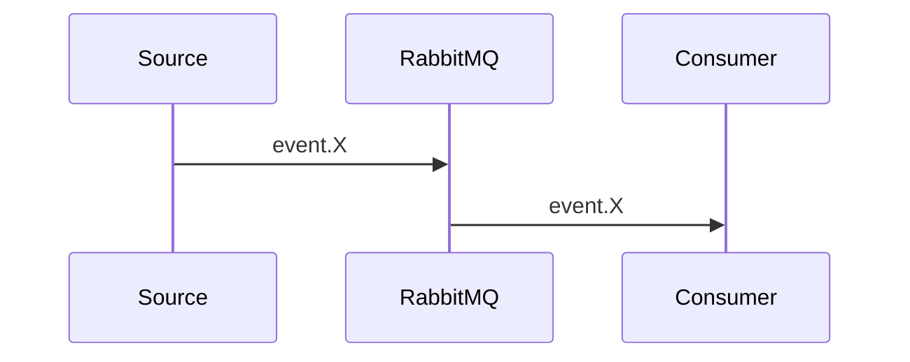
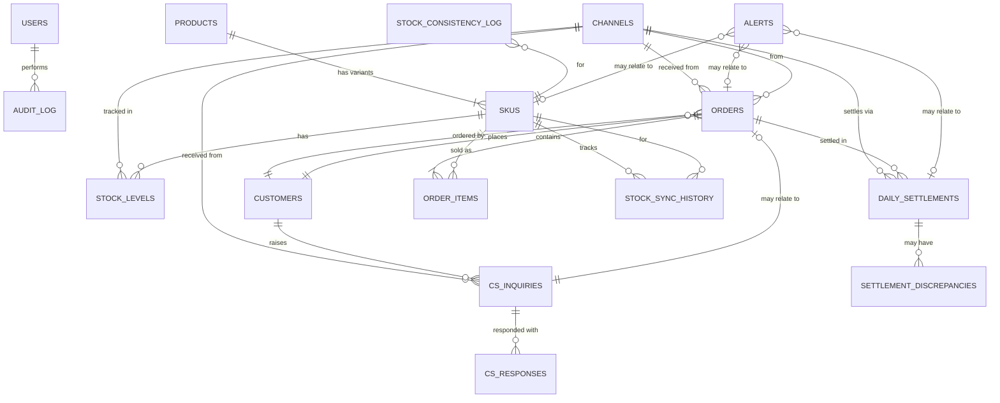
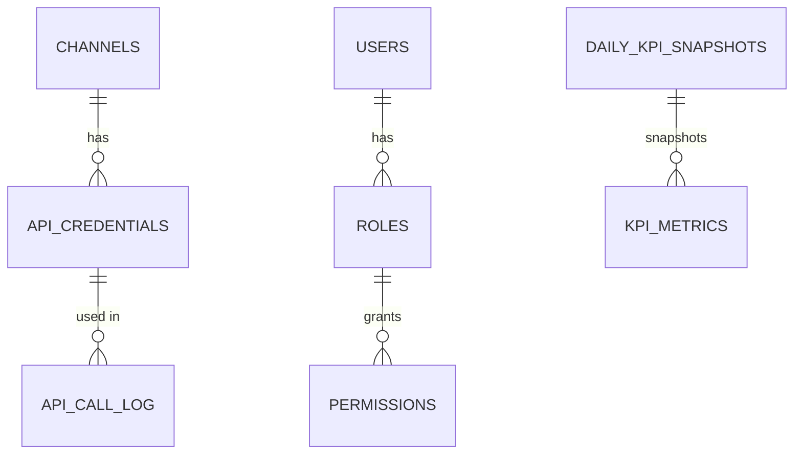
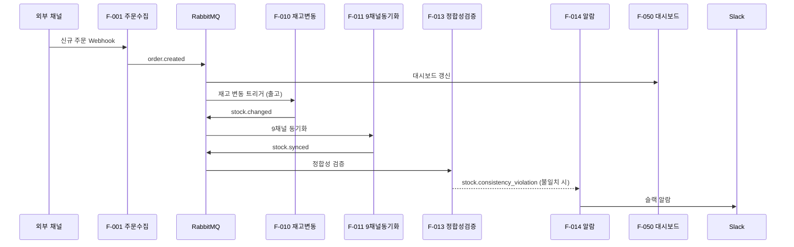

## 이 문서는

내부 시스템의 **데이터 모델·테이블·이벤트·외부 데이터 매핑·라이프사이클을 정의한 명세 문서**.

T4 산출물 흐름에서의 위치:

```
[T4-6 기능 정의] + [T4-8 정책 정의] → [T4-9 데이터 정의서] → 구현 (DB·이벤트·외부 연동)
                                            ↓
                                    "어떤 데이터·구조·흐름"
```

### 다른 산출물과의 관계

|산출물|데이터 관점|
|---|---|
|**T4-2 TO-BE**|시스템 아키텍처에서 데이터 흐름 개요|
|**T4-5 업무 흐름도**|업무에서 데이터 입·출력|
|**T4-6 기능 정의**|기능에서 사용 데이터|
|**T4-8 정책 정의**|데이터 보관·정합성·개인정보 정책|
|**T4-9 데이터 정의서 (본 문서)**|**데이터 자체의 상세 명세 (테이블·필드·관계·이벤트)**|
|**T4-10 권한**|데이터별 접근 권한|
|**T4-11 자동화 로직**|데이터 가공·계산|

**핵심**: T4-9는 **"데이터 자체"의 상세** — 다른 모든 산출물의 데이터 기반.

### 내부 시스템 데이터의 5가지 유형

|유형|의미|예시|
|---|---|---|
|**마스터 데이터 (Master)**|핵심 비즈니스 엔티티|상품·SKU·고객·사용자|
|**트랜잭션 데이터 (Transactional)**|거래·이벤트|주문·재고 변동·CS 문의|
|**참조 데이터 (Reference)**|코드·분류|채널 코드·상태 코드·배송사|
|**운영 데이터 (Operational)**|시스템 작동 데이터|로그·작업 큐·세션|
|**분석 데이터 (Analytical)**|집계·통계|KPI·일별 정산 집계|

본 가이드는 5가지 모두 다룸.

### 데이터 정의의 8가지 측면

|측면|핵심 질문|
|---|---|
|**개념 모델 (Conceptual)**|어떤 엔티티가 있나·어떻게 연결|
|**논리 모델 (Logical)**|어떤 테이블·필드·관계|
|**물리 모델 (Physical)**|어떤 타입·인덱스·제약|
|**이벤트 모델**|어떤 이벤트·발행·구독|
|**외부 데이터 매핑**|외부 시스템 ↔ OpsHub 매핑|
|**라이프사이클**|생성·변경·보관·삭제|
|**데이터 품질**|정합성·검증·결측치|
|**마이그레이션**|기존 데이터 이관 (해당 시)|

본 가이드는 8측면 모두 다룸.

### ER 다이어그램·이벤트 다이어그램 필수

- **ER 다이어그램** (Entity-Relationship): 테이블 간 관계 시각화
- **이벤트 다이어그램**: 이벤트 발행·구독 흐름
- 둘 다 dbdiagram.io·Mermaid·Lucidchart 활용

## 언제 만드나

- 기능 정의서·정책 정의서 발효 후
- 자동화 로직 정의서 (T4-11) 와 짝으로
- 개발 착수 직전 (M2 직전)
- 외부 시스템 연동 설계 시

## 어떤 툴로

|툴|추천도|이유|
|---|---|---|
|**dbdiagram.io**|⭐ 강력 추천|ER 다이어그램 + DBML 코드|
|**노션 DB + 페이지**|⭐ 추천|인벤토리·검색·검토|
|Mermaid (노션 임베드)|추천|코드 기반 ER·이벤트|
|Lucidchart·draw.io|보조|복잡한 다이어그램|
|Excel·Google Sheets|보조|외부 매핑 표|

**최적**: dbdiagram.io (ER) + 노션 (명세) + Mermaid (이벤트).

## 표준 구성

```
1. 메타
2. 데이터 인벤토리 (전체)
3. 개념 모델 (ER 다이어그램)
4. 마스터 데이터 상세
5. 트랜잭션 데이터 상세
6. 참조·운영·분석 데이터 상세
7. 이벤트 모델 (Pub/Sub)
8. 외부 데이터 매핑 (9개 채널·CafeBean 등)
9. 데이터 라이프사이클
10. 데이터 품질·정합성
11. 마이그레이션·초기 데이터 (해당 시)
12. 변경 이력·승인
```

## 테이블 1건의 상세 구성

```
A. 메타 (이름·유형·관련 기능·정책)
B. 개요·용도
C. 필드 명세 (이름·타입·제약·설명)
D. 관계 (FK·관련 테이블)
E. 인덱스·제약
F. 라이프사이클 (생성·변경·보관·삭제)
G. 권한
H. 관련 정책
```

## 들어가야 할 것

- 데이터 인벤토리·5유형 분류
- ER 다이어그램·이벤트 다이어그램
- 테이블 상세 (필드·타입·제약·관계·인덱스)
- 이벤트 상세 (페이로드·발행·구독)
- 외부 매핑 (채널·시스템 ↔ OpsHub)
- 데이터 라이프사이클 (보관 기간 등)
- 데이터 품질·정합성 기준
- 권한·정책 연결

## 작성 절차

1. **기능·업무 흐름·정책 확인** — 데이터 후보 도출
2. **개념 모델 (ER) 작성** — 엔티티 + 관계
3. **테이블 상세** — 마스터·트랜잭션·참조 등
4. **이벤트 모델** — Pub/Sub 흐름
5. **외부 데이터 매핑** — 9개 채널 등
6. **라이프사이클** — 보관·삭제 (POL-001과 연결)
7. **데이터 품질·정합성** — 검증 규칙
8. **권한 연결** (T4-10) · 정책 연결 (T4-8)
9. **개발·DBA 검토**

---

# 🔲 양식

## 메타

|항목|내용|
|---|---|
|문서 ID|DATA-YYYY-XXX|
|문서명||
|관련 기능 정의|FEAT-XXX|
|관련 정책 정의|POL-XXX|
|관련 자동화 로직|AUTO-XXX|
|작성자|(BA·DBA·백엔드)|
|작성일||
|검토자||
|상태|🟡 Draft / 🟠 Review / 🟢 Approved|
|버전|v1.0|
|다이어그램|dbdiagram.io 링크|

## 1. 데이터 인벤토리

### 1.1 통계

|유형|테이블 수|이벤트 수|
|---|---|---|
|마스터|||
|트랜잭션|||
|참조|||
|운영|||
|분석|||
|합계|||

### 1.2 테이블 인벤토리

|테이블명|유형|관련 기능|관련 정책|추정 row 수 (1년 후)|
|---|---|---|---|---|

### 1.3 이벤트 인벤토리

|이벤트명|발행자|구독자|페이로드 핵심|
|---|---|---|---|

## 2. 개념 모델 (ER 다이어그램)

### 핵심 엔티티 관계

```mermaid
erDiagram
  USERS ||--o{ ORDERS : creates
  ORDERS ||--o{ ORDER_ITEMS : contains
  SKUS ||--o{ STOCK_LEVELS : has
  ...
```

또는 dbdiagram.io 링크

## 3. 마스터 데이터 상세

### 테이블: [테이블명]

#### A. 메타

|항목|내용|
|---|---|
|테이블명||
|유형|마스터|
|관련 기능|F-XXX|
|관련 정책|POL-XXX|

#### B. 개요·용도

- (1~2문장)

#### C. 필드 명세

|#|필드명|타입|NULL|기본값|제약|설명|
|---|---|---|---|---|---|---|
|1|id|UUID|NO|uuid_generate_v4()|PK|식별자|
|2|||||||

#### D. 관계 (FK)

|FK 필드|참조 테이블·필드|관계|
|---|---|---|

#### E. 인덱스·제약

|인덱스명|컬럼|유형|
|---|---|---|

#### F. 라이프사이클

- 생성: (언제·어디서)
- 변경: (가능한가·이력 추적)
- 보관: (기간)
- 삭제: (소프트·하드·정책)

#### G. 권한

- T4-10 ROLE-XXX

#### H. 관련 정책

- POL-XXX

## 4. 트랜잭션 데이터 상세

(테이블 1건의 상세 구성과 동일)

## 5. 참조·운영·분석 데이터

(동일)

## 6. 이벤트 모델 (Pub/Sub)

### 이벤트 다이어그램



### 이벤트 상세

|이벤트명|발행자|구독자|페이로드|보관|
|---|---|---|---|---|

## 7. 외부 데이터 매핑

### 매핑 표 (외부 → OpsHub)

|외부 시스템|외부 필드|OpsHub 테이블·필드|변환 로직|
|---|---|---|---|

## 8. 데이터 라이프사이클

|데이터|활성|콜드|영구 삭제·익명화|
|---|---|---|---|

## 9. 데이터 품질·정합성

|데이터|검증 규칙|검증 시점|위반 시|
|---|---|---|---|

## 10. 마이그레이션 (해당 시)

|항목|내용|
|---|---|
|소스||
|대상||
|매핑||
|시점||

## 11. 변경 이력·승인

(표 동일)

---

# 📌 예시 — DATA-2026-OPSHUB 샵플링 운영 자동화 허브 데이터 정의서

> 가상 사례. OPSHUB-2026 프로젝트의 데이터 정의서

## 메타

|항목|내용|
|---|---|
|문서 ID|DATA-2026-OPSHUB|
|문서명|OpsHub 데이터 정의서 v1.0|
|관련 기능 정의|FEAT-2026-OPSHUB|
|관련 정책 정의|POL-2026-OPSHUB|
|관련 자동화 로직|AUTO-2026-OPSHUB (T4-11)|
|작성자|박분석 (BA) + 김데브 (백엔드 리드) + 박DBA (DBA)|
|작성일|2026-09-15|
|검토자|홍길동·이큐에이·박CTO|
|상태|🟢 Approved (2026-09-25 발효)|
|버전|v1.0|
|다이어그램|dbdiagram.io `opshub-2026`|

## 1. 데이터 인벤토리

### 1.1 통계

|유형|테이블 수|이벤트 수|
|---|---|---|
|**마스터**|8|—|
|**트랜잭션**|12|—|
|**참조**|6|—|
|**운영 (로그·큐)**|9|—|
|**분석 (집계)**|5|—|
|**이벤트 (RabbitMQ)**|—|**14**|
|**합계**|**40**|**14**|

### 1.2 핵심 테이블 인벤토리 (마스터·트랜잭션 발췌)

|테이블명|유형|관련 기능|관련 정책|추정 row (1년)|
|---|---|---|---|---|
|**users**|마스터|F-051·070|POL-006·060|~50 (운영팀)|
|**channels**|참조|F-080~086|POL-050|9 (고정)|
|**skus**|마스터|F-010·011·013|POL-010|~5,000|
|**products**|마스터|F-010·011|POL-010|~2,000|
|**customers**|마스터|F-001·030|POL-005 (개인정보)|~150,000|
|**orders**|트랜잭션|F-001·002·003|POL-001·005|~500,000|
|**order_items**|트랜잭션|F-001·011|POL-001|~1,500,000|
|**stock_levels**|트랜잭션|F-010·011·013|POL-010|~45,000 (SKU × 9 채널 + OpsHub)|
|**stock_sync_history**|운영|F-011·012|POL-010|~250,000|
|**stock_consistency_log**|운영|F-013|POL-010|~100,000|
|**daily_settlements**|트랜잭션|F-020·021|POL-020|~3,300 (9 × 365)|
|**settlement_discrepancies**|트랜잭션|F-022|POL-021|~150|
|**cs_inquiries**|트랜잭션|F-030·032|POL-030|~30,000|
|**cs_responses**|트랜잭션|F-032·033|POL-031|~30,000|
|**alerts**|운영|F-040|POL-040|~5,000|
|**api_credentials**|운영|F-080~086|POL-050 (KMS)|~30|
|**api_call_log**|운영|F-001·011·020·030|POL-060|~10,000,000 (90일)|
|**audit_log**|운영|(전체)|POL-006·060|~5,000,000|
|**daily_kpi_snapshots**|분석|F-050·041|—|~3,650|
|(외 21개 테이블)|||||

### 1.3 이벤트 인벤토리 (RabbitMQ 14건)

|이벤트명|발행자|구독자|페이로드 핵심|
|---|---|---|---|
|**order.created**|F-001|F-050 (대시보드)·F-002|order_id·channel·items|
|order.status_changed|F-002|F-050·F-010 (출고 트리거)|order_id·old·new_status|
|order.shipped|F-003|F-050·F-024 (정산)|order_id·tracking|
|**stock.changed**|F-010|F-011·F-014·F-015|sku·delta·source|
|stock.synced|F-011|F-013·F-050|sku·channels·success|
|stock.sync_failed|F-011·F-012|F-014 (알람)·F-050|sku·failed_channels|
|stock.consistency_violation|F-013|F-014 (알람)|sku·channels·diff|
|stock.low|F-015|F-040 (알람)|sku·level|
|**settlement.collected**|F-020|F-021·F-050|channel·date·amount|
|settlement.discrepancy|F-022|F-040 (알람)|settlement_id·diff|
|**cs.inquiry_received**|F-030|F-031·F-050|inquiry_id·channel|
|cs.inquiry_responded|F-032|F-033 (자동 게시)|inquiry_id·response|
|cs.sla_breach|F-034|F-040 (알람)|inquiry_id·age|
|**alert.created**|F-040|(Slack)·F-050|alert_id·level·message|

---

## 2. 개념 모델 (ER 다이어그램)

### 핵심 엔티티 관계 (Mermaid)



(dbdiagram.io: `opshub-2026/erd-main`)

### 보조 ER (운영·분석)



---

## 3. 마스터 데이터 상세 (3개 발췌)

### 3.1 테이블: `skus`

#### A. 메타

|항목|내용|
|---|---|
|테이블명|`skus`|
|유형|마스터|
|관련 기능|F-010·011·013|
|관련 정책|POL-010 (재고 정합성)|

#### B. 개요·용도

**상품 SKU (재고 관리 단위)**. 9개 채널에 매핑되는 OpsHub 기준 SKU. 재고 동기화·주문·정산의 핵심 마스터.

#### C. 필드 명세

|#|필드명|타입|NULL|기본값|제약|설명|
|---|---|---|---|---|---|---|
|1|id|UUID|NO|uuid_generate_v4()|**PK**|OpsHub SKU 식별자|
|2|sku_code|VARCHAR(50)|NO|—|**UNIQUE**|자체 SKU 코드 (예: TSHIRT-M-BLK)|
|3|product_id|UUID|NO|—|**FK → products.id**|상품|
|4|name|VARCHAR(200)|NO|—|—|SKU 이름 (예: 티셔츠 M 검정)|
|5|option_size|VARCHAR(20)|YES|NULL|—|사이즈 옵션|
|6|option_color|VARCHAR(20)|YES|NULL|—|색상 옵션|
|7|barcode|VARCHAR(50)|YES|NULL|UNIQUE|바코드|
|8|cost_price|DECIMAL(10,2)|YES|NULL|—|원가|
|9|sale_price|DECIMAL(10,2)|NO|—|CHECK (>0)|판매가|
|10|is_active|BOOLEAN|NO|TRUE|—|활성 상태|
|11|created_at|TIMESTAMPTZ|NO|NOW()|—|생성 시점|
|12|updated_at|TIMESTAMPTZ|NO|NOW()|—|수정 시점|
|13|created_by|UUID|YES|NULL|FK → users.id|등록자|

#### D. 관계 (FK)

|FK 필드|참조|관계|
|---|---|---|
|product_id|products(id)|N:1|
|created_by|users(id)|N:1|
|(역방향) stock_levels.sku_id ←||1:N|
|(역방향) order_items.sku_id ←||1:N|
|(역방향) stock_sync_history.sku_id ←||1:N|

#### E. 인덱스·제약

|인덱스명|컬럼|유형|
|---|---|---|
|pk_skus|id|PRIMARY|
|uq_skus_sku_code|sku_code|UNIQUE|
|uq_skus_barcode|barcode (NULLS)|UNIQUE|
|idx_skus_product_id|product_id|BTREE|
|idx_skus_is_active|is_active WHERE TRUE|PARTIAL|

#### F. 라이프사이클

- **생성**: MD가 상품 등록 시·외부 채널에서 신규 SKU 감지
- **변경**: 가격·옵션·활성 상태 변경 가능 (audit_log 기록)
- **보관**: 영구 (is_active=false로 비활성화)
- **삭제**: 하드 삭제 금지·is_active=false만

#### G. 권한 (T4-10)

- 읽기: 전체 운영팀
- 쓰기: MD·운영팀장만

#### H. 관련 정책

- POL-010 (재고 정합성)
- POL-001 (데이터 보관: 영구)

---

### 3.2 테이블: `customers`

#### A. 메타

|항목|내용|
|---|---|
|테이블명|`customers`|
|유형|마스터|
|관련 기능|F-001·030|
|관련 정책|**POL-005 (개인정보)**|

#### B. 개요·용도

**고객 마스터** (9개 채널 통합). 개인정보 포함 → POL-005 엄격 적용.

#### C. 필드 명세

|#|필드명|타입|NULL|기본값|제약|설명|
|---|---|---|---|---|---|---|
|1|id|UUID|NO|uuid_generate_v4()|PK|OpsHub 고객 ID|
|2|name_encrypted|BYTEA|YES|NULL|—|**이름 (AES-256 암호화)**|
|3|name_hash|VARCHAR(64)|YES|NULL|INDEX|이름 검색용 해시 (SHA-256)|
|4|phone_encrypted|BYTEA|YES|NULL|—|**전화번호 (AES-256 암호화)**|
|5|phone_hash|VARCHAR(64)|YES|NULL|INDEX|전화 해시|
|6|email_encrypted|BYTEA|YES|NULL|—|**이메일 (AES-256 암호화)**|
|7|email_hash|VARCHAR(64)|YES|NULL|INDEX, UNIQUE NULLS|이메일 해시 (중복 감지)|
|8|birth_year|INT|YES|NULL|—|출생 연도 (개인정보 최소화)|
|9|gender|VARCHAR(10)|YES|NULL|—|성별|
|10|is_anonymized|BOOLEAN|NO|FALSE|—|익명화 여부|
|11|anonymized_at|TIMESTAMPTZ|YES|NULL|—|익명화 시점|
|12|last_order_at|TIMESTAMPTZ|YES|NULL|INDEX|마지막 주문 시점 (보관 기간 기준)|
|13|created_at|TIMESTAMPTZ|NO|NOW()|—||
|14|updated_at|TIMESTAMPTZ|NO|NOW()|—||

#### D. 관계

|FK|참조|관계|
|---|---|---|
|(역방향) orders.customer_id ←||1:N|
|(역방향) cs_inquiries.customer_id ←||1:N|

#### E. 인덱스

|인덱스명|컬럼|유형|
|---|---|---|
|pk_customers|id|PRIMARY|
|idx_customers_name_hash|name_hash|BTREE|
|idx_customers_phone_hash|phone_hash|BTREE|
|uq_customers_email_hash|email_hash (NULLS)|UNIQUE|
|idx_customers_last_order_at|last_order_at|BTREE|

#### F. 라이프사이클 ⭐

- **생성**: F-001 (주문 수집)·F-030 (CS) 시 자동 생성 (중복 감지: email_hash)
- **변경**: 변경 가능 (audit_log 기록)
- **보관**: **마지막 거래 후 2년** (POL-005)
- **익명화**: 2년 경과 시 AUTO-008 (개인정보 자동 익명화)
    - `name_encrypted·phone_encrypted·email_encrypted` → NULL
    - `is_anonymized` = TRUE·`anonymized_at` = NOW()
    - 통계용 필드 (birth_year·gender) 만 보존
- **하드 삭제**: 고객 직접 요청 시 (개인정보보호법 제21조)

#### G. 권한

- 읽기 (식별 정보): MD·CS·운영팀장만 (감사 로그 필수)
- 익명화된 데이터: 전체 운영팀 (통계용)

#### H. 관련 정책

- **POL-005 (개인정보)** — 가장 중요
- POL-006 (권한)
- POL-060 (접근 로그)

---

### 3.3 테이블: `channels` (참조 — 9개 고정)

#### C. 필드 명세

|#|필드명|타입|NULL|설명|
|---|---|---|---|---|
|1|id|UUID|NO|PK|
|2|code|VARCHAR(20)|NO|UNIQUE (예: coupang·naver·11st)|
|3|display_name|VARCHAR(50)|NO|한국어 (쿠팡·네이버 등)|
|4|api_type|VARCHAR(20)|NO|rest·csv·hybrid|
|5|webhook_supported|BOOLEAN|NO|true·false|
|6|rate_limit_per_min|INT|NO|API Rate Limit|
|7|is_active|BOOLEAN|NO|활성|
|8|created_at|TIMESTAMPTZ|NO||

#### 초기 데이터 (9건 고정 — 마이그레이션 스크립트)

|code|display_name|api_type|webhook|rate_limit|
|---|---|---|---|---|
|coupang|쿠팡|rest|true|100|
|naver|네이버 스토어팜|hybrid|true|60|
|11st|11번가|rest|false|100|
|gmarket|G마켓|rest|false|100|
|auction|옥션|rest|false|100|
|kakao|카카오 채널|rest|false|30|
|(+ 3개)|||||

---

## 4. 트랜잭션 데이터 상세 (3개 발췌)

### 4.1 테이블: `orders`

#### B. 개요

**모든 주문 통합 (9개 채널)**. 매우 핵심 테이블. POL-001 (5년 보관)·POL-005 (개인정보) 모두 적용.

#### C. 필드 명세 (핵심 발췌)

|#|필드명|타입|제약|설명|
|---|---|---|---|---|
|1|id|UUID|PK|OpsHub 주문 ID|
|2|channel_id|UUID|FK, NOT NULL|채널|
|3|channel_order_id|VARCHAR(100)|NOT NULL|채널 측 주문번호|
|4|customer_id|UUID|FK, NOT NULL|고객|
|5|status|VARCHAR(30)|NOT NULL|상태 (참조 order_statuses)|
|6|total_amount|DECIMAL(12,2)|NOT NULL|총 금액|
|7|shipping_fee|DECIMAL(10,2)|NOT NULL DEFAULT 0|배송비|
|8|discount_amount|DECIMAL(10,2)|NOT NULL DEFAULT 0|할인|
|9|tax_amount|DECIMAL(10,2)|NOT NULL|부가세|
|10|shipping_address_encrypted|BYTEA|YES|암호화|
|11|shipping_zipcode|VARCHAR(10)|YES|(검색·통계용 평문)|
|12|tracking_number|VARCHAR(50)|YES|송장번호|
|13|shipped_at|TIMESTAMPTZ|YES|발송 시점|
|14|delivered_at|TIMESTAMPTZ|YES|배송 완료|
|15|is_active|BOOLEAN|NOT NULL DEFAULT TRUE|소프트 삭제|
|16|created_at|TIMESTAMPTZ|NOT NULL DEFAULT NOW()||
|17|updated_at|TIMESTAMPTZ|NOT NULL DEFAULT NOW()||
|(외 8개 컬럼)|||||

#### E. 인덱스·제약

|인덱스명|컬럼|유형|
|---|---|---|
|pk_orders|id|PRIMARY|
|**uq_orders_channel**|(channel_id, channel_order_id)|**UNIQUE (idempotency)**|
|idx_orders_customer_id|customer_id|BTREE|
|idx_orders_status|status|BTREE|
|idx_orders_created_at|created_at|BTREE|
|idx_orders_status_created|(status, created_at)|COMPOSITE|

→ **UNIQUE (channel_id, channel_order_id) 가 중복 주문 방지의 핵심**

#### F. 라이프사이클

- 생성: F-001 (자동·idempotent)
- 변경: F-002 (상태)·F-003 (송장) — audit_log 기록
- 보관: **3년 활성·3~5년 콜드·5년 후 삭제** (POL-001)
- 분쟁·법령 예외: 별도 보관

---

### 4.2 테이블: `stock_levels`

#### B. 개요

**SKU × 채널·OpsHub 재고 수준** (45,000 row ≈ 5,000 SKU × 9 채널). 재고 정합성의 핵심.

#### C. 필드 명세

|#|필드명|타입|제약|설명|
|---|---|---|---|---|
|1|id|UUID|PK||
|2|sku_id|UUID|FK, NOT NULL||
|3|channel_id|UUID|FK, NULLABLE|NULL = OpsHub 기준 재고|
|4|quantity|INT|NOT NULL CHECK (>=0)|재고 수량 (POL-012 음수 금지)|
|5|reserved_quantity|INT|NOT NULL DEFAULT 0|예약 (주문 진행 중)|
|6|available_quantity|INT|GENERATED `quantity - reserved`|가용 재고|
|7|last_synced_at|TIMESTAMPTZ|YES|마지막 동기화|
|8|last_consistency_check_at|TIMESTAMPTZ|YES|마지막 정합성 검증|
|9|is_consistent|BOOLEAN|NOT NULL DEFAULT TRUE|정합성 OK 여부|
|10|updated_at|TIMESTAMPTZ|NOT NULL DEFAULT NOW()||

#### E. 인덱스

|인덱스명|컬럼|유형|
|---|---|---|
|pk_stock_levels|id|PRIMARY|
|**uq_stock_sku_channel**|(sku_id, channel_id)|UNIQUE (NULLS NOT DISTINCT)|
|idx_stock_is_consistent|is_consistent WHERE FALSE|PARTIAL|

→ SKU × 채널 1:1 + 정합성 위반 SKU 빠른 조회

---

### 4.3 테이블: `cs_inquiries`

#### B. 개요

**9개 채널 CS 문의 통합 큐**. POL-005·030 적용.

#### C. 필드 명세 (핵심)

|#|필드명|타입|제약|설명|
|---|---|---|---|---|
|1|id|UUID|PK||
|2|channel_id|UUID|FK||
|3|channel_inquiry_id|VARCHAR(100)|NOT NULL|채널 측 ID|
|4|customer_id|UUID|FK, YES|(미연결 케이스)|
|5|order_id|UUID|FK, YES|자동 매칭 (가능 시)|
|6|type|VARCHAR(30)|YES|AI 분류 (F-031): refund·exchange·delivery·...|
|7|type_confidence|DECIMAL(3,2)|YES|AI 신뢰도 (0~1)|
|8|title|TEXT|YES|제목|
|9|body_encrypted|BYTEA|YES|내용 (개인정보 포함 가능)|
|10|status|VARCHAR(30)|NOT NULL|pending·in_progress·responded·closed|
|11|assigned_to|UUID|FK → users.id, YES|담당자|
|12|sla_first_response_due_at|TIMESTAMPTZ|YES|1차 응대 SLA (POL-030)|
|13|sla_resolution_due_at|TIMESTAMPTZ|YES|해결 SLA|
|14|created_at|TIMESTAMPTZ|NOT NULL||

#### E. 인덱스

|인덱스명|컬럼|유형|
|---|---|---|
|**uq_cs_channel**|(channel_id, channel_inquiry_id)|UNIQUE|
|idx_cs_status|status WHERE status != 'closed'|PARTIAL|
|idx_cs_sla|sla_first_response_due_at WHERE status = 'pending'|PARTIAL|

→ SLA 위반 빠른 조회 (F-034)

---

## 5. 참조·운영·분석 데이터 (간단 발췌)

### 5.1 참조 테이블

|테이블|데이터|비고|
|---|---|---|
|channels|9개 채널 고정|위 참조|
|order_statuses|new·confirmed·shipped·delivered·cancelled·returned|참조|
|cs_types|refund·exchange·delivery·product·other|참조|
|alert_levels|critical·high·medium·low|참조|
|api_error_codes|(수십 개)|참조|
|sku_categories|(계층 구조)|참조|

### 5.2 운영 테이블 (로그·큐)

|테이블|용도|보관|
|---|---|---|
|stock_sync_history|동기화 이력|1년|
|stock_consistency_log|정합성 검증 로그|1년|
|settlement_discrepancies|정산 오차|5년 (POL-021)|
|alerts|알람 이력|1년|
|api_credentials|외부 API 자격 증명 (KMS)|영구 (회전)|
|api_call_log|외부 API 호출 로그|**90일** (POL-060)|
|audit_log|시스템 감사 로그|**90일** (POL-060)|
|rabbitmq_dead_letters|DLQ (실패 메시지)|30일|
|user_sessions|JWT 세션|8시간|

### 5.3 분석 테이블 (집계)

|테이블|용도|갱신|
|---|---|---|
|daily_kpi_snapshots|KPI 일별 스냅샷|매일|
|weekly_kpi_snapshots|주별|매주 월요일|
|monthly_reports|월별 보고서|매월 1일|
|channel_performance_daily|채널별 성과 일별|매일|
|sku_velocity_30d|SKU 30일 회전율|매일|

---

## 6. 이벤트 모델 (Pub/Sub)

### 6.1 이벤트 다이어그램 (핵심 흐름)



### 6.2 이벤트 페이로드 상세 (4개 발췌)

#### Event: `order.created`

```json
{
  "event_id": "uuid",
  "event_type": "order.created",
  "timestamp": "2026-12-01T10:30:00Z",
  "version": "v1",
  "payload": {
    "order_id": "uuid",
    "channel_id": "uuid",
    "channel_code": "coupang",
    "channel_order_id": "20261201-001",
    "customer_id": "uuid",
    "total_amount": 35000,
    "items": [
      {"sku_id": "uuid", "quantity": 1, "price": 35000}
    ],
    "created_at": "2026-12-01T10:30:00Z"
  }
}
```

**구독자**: F-050 (대시보드)·F-010 (재고 변동 — 단, 단계별로 다름)

#### Event: `stock.changed`

```json
{
  "event_id": "uuid",
  "event_type": "stock.changed",
  "timestamp": "...",
  "version": "v1",
  "payload": {
    "sku_id": "uuid",
    "delta": -1,
    "source": "order.shipped",
    "source_id": "order_id_uuid"
  }
}
```

**구독자**: F-011 (9채널 동기화)

#### Event: `stock.consistency_violation`

```json
{
  "event_id": "uuid",
  "event_type": "stock.consistency_violation",
  "timestamp": "...",
  "version": "v1",
  "payload": {
    "sku_id": "uuid",
    "channel_inconsistencies": [
      {"channel_code": "coupang", "expected": 10, "actual": 9},
      {"channel_code": "naver", "expected": 10, "actual": 10}
    ],
    "severity": "high"
  }
}
```

**구독자**: F-014 (재고 불일치 알람)

#### Event: `cs.sla_breach`

```json
{
  "event_id": "uuid",
  "event_type": "cs.sla_breach",
  "payload": {
    "inquiry_id": "uuid",
    "channel_code": "coupang",
    "customer_id": "uuid",
    "age_hours": 25,
    "sla_target_hours": 24
  }
}
```

**구독자**: F-040 (이상 알람)

### 6.3 이벤트 표준 (모든 이벤트 공통)

|필드|의미|
|---|---|
|`event_id`|UUID·idempotency key|
|`event_type`|점 분리 (예: `order.created`)|
|`timestamp`|ISO 8601·UTC|
|`version`|v1·v2 (스키마 버전)|
|`payload`|이벤트별 상세 데이터|

- **저장**: RabbitMQ + DB 영구 보관 (`event_store` 테이블)
- **재시도**: 실패 시 DLQ → 1·5·30분 백오프
- **순서 보장**: SKU별·주문별 FIFO

---

## 7. 외부 데이터 매핑

### 7.1 매핑 표 (외부 → OpsHub) — 쿠팡 예시

|외부 (쿠팡)|OpsHub 테이블·필드|변환 로직|
|---|---|---|
|`vendorItemId`|`skus.sku_code` (매핑)|별도 매핑 테이블 (`sku_channel_mappings`)|
|`orderId`|`orders.channel_order_id`|그대로|
|`productPrice`|`order_items.unit_price`|DECIMAL 변환|
|`orderedAt` (KST)|`orders.created_at`|UTC 변환|
|`receiverName`|`customers.name_encrypted`|**AES-256 암호화**|
|`receiverPhoneNumber`|`customers.phone_encrypted`|**AES-256 암호화**|
|`orderStatus` (Korean)|`orders.status`|매핑: "결제완료"→"new", "배송중"→"shipped"|
|`payAmount`|`orders.total_amount`|그대로|
|`shippingFee`|`orders.shipping_fee`|그대로|

### 7.2 매핑 표 — 네이버 (CSV 형식 차이)

|외부 (네이버 CSV)|OpsHub|변환|
|---|---|---|
|컬럼 "주문번호"|`orders.channel_order_id`|트리밍|
|컬럼 "상품번호"|`sku_channel_mappings` 참조|매핑|
|컬럼 "결제일자" (한국 시간)|`orders.created_at`|KST→UTC + 형식 변환|
|컬럼 "구매자명"|`customers.name_encrypted`|암호화|
|컬럼 "주문 상태" (한국어)|`orders.status`|매핑 테이블|
|컬럼 "정산예정금액"|`daily_settlements.settlement_amount`|그대로|
|컬럼 "수수료"|`daily_settlements.fee`|그대로|
|(외 30개 컬럼)|||

### 7.3 SKU 채널 매핑 테이블 (`sku_channel_mappings`)

|필드|타입|설명|
|---|---|---|
|sku_id|UUID FK|OpsHub SKU|
|channel_id|UUID FK|채널|
|channel_sku_code|VARCHAR|채널 측 SKU 코드|
|created_at|TIMESTAMPTZ||
|UNIQUE (sku_id, channel_id)|||

→ 외부 채널의 다양한 SKU 식별자를 OpsHub의 통일된 SKU로 매핑

### 7.4 CafeBean 자동 입력 매핑

|OpsHub|CafeBean|변환|
|---|---|---|
|daily_settlements.channel|CafeBean 매출처|매핑 테이블|
|daily_settlements.amount|CafeBean 매출액|그대로|
|daily_settlements.fee|CafeBean 수수료 (지급비용)|그대로|
|daily_settlements.tax|CafeBean 부가세 (예수금)|그대로|

---

## 8. 데이터 라이프사이클

> POL-001·005·060과 정합

|데이터|활성 보관|콜드 스토리지|영구 삭제·익명화|
|---|---|---|---|
|**orders**|3년 (Hot)|3~5년 (Cold)|5년 후 (POL-001)|
|order_items|(orders와 동일)|||
|**customers (개인정보)**|마지막 거래 후 2년 (Hot)|—|2년 후 익명화 (POL-005)|
|**stock_levels**|영구|—|(is_active=false로 비활성화)|
|stock_sync_history|1년|—|1년 후 삭제|
|daily_settlements|5년 (법령)|—|5년 후|
|settlement_discrepancies|5년|—|5년 후|
|cs_inquiries|거래 후 2년 (개인정보)|—|2년 후 익명화|
|cs_responses|(inquiries와 동일)|||
|alerts|1년|—|1년 후|
|api_call_log|90일|—|90일 후 (POL-060)|
|audit_log|90일|—|90일 후|
|user_sessions|8시간 (JWT)|—|만료 후|
|daily_kpi_snapshots|5년|—|(영구 보존 검토)|

### 자동 정리 작업 (AUTO-007·008)

- **매일 02:30**: 보관 기간 도과 데이터 정리·익명화 (T4-11 AUTO-007·008)
- 실패 시: 슬랙 알람
- 정리 결과 로그: `data_lifecycle_log`

---

## 9. 데이터 품질·정합성

### 9.1 핵심 검증 규칙

|데이터|검증 규칙|검증 시점|위반 시|
|---|---|---|---|
|orders|UNIQUE (channel_id, channel_order_id)|INSERT|중복 거부 (idempotency)|
|orders.total_amount|> 0|INSERT·UPDATE|거부|
|stock_levels.quantity|>= 0|INSERT·UPDATE|**0으로 클램프 + 경고 알람** (POL-012)|
|customers.email_hash|채널 무관 UNIQUE|INSERT|기존 고객 매칭|
|daily_settlements|(channel_id, date) UNIQUE|INSERT|중복 거부|
|cs_inquiries|UNIQUE (channel_id, channel_inquiry_id)|INSERT|중복 거부|
|**재고 정합성**|9개 채널 ↔ OpsHub 일치율 ≥ 99.9% (POL-010)|매 동기화 후 5분 + 매일 자정|F-013 → F-014 알람|
|**정산 정합성**|매출-정산 오차 ≤ 1만원/월 (POL-020)|일별·월별|F-022 추적|

### 9.2 결측치·이상치 처리

|케이스|처리|
|---|---|
|customers 개인정보 NULL|허용 (B2B·익명 주문 가능)|
|orders.shipping_address NULL|거부 (필수)|
|stock_levels.quantity 음수|0으로 클램프 + 경고|
|외부 채널 데이터 형식 변경|어댑터 알람 + 수동 대응|

### 9.3 데이터 검증 자동화

- **매일 자정**: 자동 데이터 품질 검증 (`data_quality_log`)
- **월별 리포트**: 데이터 품질 점수 (정합성·완결성·정확성)
- **Datadog 모니터링**: 핵심 메트릭 실시간

---

## 10. 마이그레이션·초기 데이터

### 10.1 초기 시드 데이터 (Phase 1 시작 시)

|데이터|출처|양|
|---|---|---|
|channels|9개 고정 (수동 입력)|9|
|order_statuses|6개 표준|6|
|cs_types|5개 표준|5|
|alert_levels|4개|4|
|users (운영팀)|8명 (HR 데이터)|8|
|roles·permissions|T4-10 정의|~30|
|skus·products|**샵플링 API에서 일괄 import**|5,000+|
|sku_channel_mappings|**샵플링·각 채널에서 일괄 매핑**|~45,000|

### 10.2 마이그레이션 — 기존 데이터

|데이터|소스|대상|시점|
|---|---|---|---|
|운영팀 사용자 정보|HR DB|users|Phase 1 시작|
|상품 카탈로그|샵플링|products·skus|Phase 1 시작|
|채널 SKU 매핑|샵플링·각 채널|sku_channel_mappings|Phase 1 시작 (수동 검증 필요)|
|과거 주문 (3개월)|9개 채널|orders·order_items|Phase 1 — 분석용|
|과거 정산 (1년)|9개 채널·CafeBean|daily_settlements|Phase 2 시작|

### 10.3 마이그레이션 전략

- **이중화 운영**: 마이그레이션 1개월간 신·구 시스템 병행 (NFR-012)
- **정합성 검증**: 마이그레이션 후 100% 일치 확인 (샘플 1,000건)
- **롤백 계획**: 문제 발견 시 24시간 내 롤백 가능

---

## 11. 변경 이력·승인

|버전|일자|변경자|변경 내용|
|---|---|---|---|
|v0.1|2026-08-30|박분석·박DBA|초안 (테이블 30개·이벤트 10개)|
|v0.5|2026-09-08|박DBA·김데브|인덱스·제약·성능 검토 반영|
|v0.8|2026-09-15|박분석·박CFO·법무|개인정보·라이프사이클 검토 반영|
|v0.9|2026-09-20|박DBA·김데브|외부 매핑 보완 (9개 채널)|
|v1.0|2026-09-25|박분석|발효 (테이블 40개·이벤트 14개)|

**승인**:

- 박분석 (BA) — 2026-09-25
- 박DBA (DBA) — 2026-09-25
- 김데브 (백엔드 리드) — 2026-09-25
- 홍길동 (PM) — 2026-09-25
- 박CTO — 2026-09-25
- 박CFO·법무팀 (개인정보·정산 부분) — 2026-09-25

---

## 작성 팁

- **5유형 분류** — 마스터·트랜잭션·참조·운영·분석
- **8측면 다룸** — 개념·논리·물리·이벤트·외부 매핑·라이프사이클·품질·마이그레이션
- **ER 다이어그램 필수** — dbdiagram.io·Mermaid
- **이벤트 다이어그램** — Pub/Sub 흐름
- **외부 매핑 표** — 9개 채널 ↔ OpsHub 명확
- **idempotency 키** — UNIQUE 제약 핵심
- **개인정보 암호화** — 컬럼 레벨 AES-256
- **인덱스 설계** — 핵심 쿼리 기준
- **라이프사이클 명확** — 정책 (T4-8) 과 정합
- **품질·정합성 규칙** — Pass/Fail 명확
- **마이그레이션 전략** — 이중화·검증·롤백
- **DBA·법무·CFO 검토** — 개인정보·정산
- **버전 관리** — 스키마 변경 추적
- **권한 연결** (T4-10) — 데이터별 접근

## 참고할 만한 외부 예시

- **dbdiagram.io** — ER 다이어그램 표준 https://dbdiagram.io/
- **DBML (Database Markup Language)** https://dbml.dbdiagram.io/
- **PostgreSQL 공식 문서 — Schema Design** https://www.postgresql.org/docs/
- **Database Refactoring (Scott Ambler)** (책)
- **Designing Data-Intensive Applications (Martin Kleppmann)** (책)
- **Event-Driven Microservices Patterns** https://microservices.io/patterns/data/event-driven-architecture.html
- **GDPR Data Lifecycle Guide** https://gdpr.eu/data-protection/

## 자주 하는 실수

- **개념 모델 (ER) 없음** — 관계 모호 → 개발 시 막힘
- **idempotency 키 누락** — 중복 데이터 사고
- **개인정보 평문 저장** — 법령 위반·유출 사고
- **인덱스 설계 부실** — 운영 시 성능 ↓
- **외부 매핑 모호** — 9개 채널 별로 다른 형식
- **라이프사이클 정의 X** — 데이터 무한 누적
- **품질 검증 규칙 없음** — 데이터 오염
- **이벤트 페이로드 비표준** — 버전 관리 불가
- **마이그레이션 전략 없음** — 시스템 전환 사고
- **DBA·법무 검토 X** — 성능·법령 문제
- **권한 연결 X** — 무분별한 데이터 접근
- **소프트 vs 하드 삭제 모호** — 실수로 영구 삭제
- **버전 관리 X** — 스키마 변경 추적 불가

## 작성 후 체크

- [ ] 5유형 분류 (마스터·트랜잭션·참조·운영·분석) 되었는가
- [ ] 데이터 인벤토리 (테이블·이벤트) 정리되었는가
- [ ] ER 다이어그램 있는가 (dbdiagram.io·Mermaid)
- [ ] 핵심 테이블 (Must) 8측면 모두 명세되었는가
- [ ] 이벤트 모델 (Pub/Sub) 정의되었는가
- [ ] 이벤트 페이로드 표준 있는가
- [ ] 외부 데이터 매핑 (9개 채널·CafeBean) 명확한가
- [ ] idempotency 키 (UNIQUE 제약) 적용되었는가
- [ ] 개인정보 암호화 명세되었는가 (POL-005)
- [ ] 인덱스·제약 설계되었는가
- [ ] 라이프사이클 (활성·콜드·삭제) 명확한가 (POL-001·005)
- [ ] 데이터 품질·정합성 규칙 있는가
- [ ] 마이그레이션·초기 데이터 전략 있는가
- [ ] 권한 (T4-10) 연결되었는가
- [ ] 정책 (T4-8) 연결되었는가
- [ ] DBA·법무·CFO 검토 받았는가
- [ ] 버전 관리·승인되었는가

---
